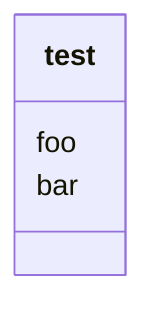

- Nom :
- Prénom :

# Notion.so

[Lien vers page]()<!-- Collez le lien entre les parenthèses -->

<!-- Pensez à rendre la page publique -->

[lien vers le fichier CSV] <!-- Ajoutez des parenthèses après avoir copié le fichier, il proposera de compléter le nom du fichierr-->

# Javascript

[Lien vers le fichier JSON] <!-- à compléter -->

[Complétez et testez le fichier JS](test.js)

# TypeScript

[Fichier TypeScript] <!-- Dupliquer et renommer le .js en .ts, ajoutez ici le lien -->

```ts
// déclaration de type recopié du .ts
```

# Mermaid



# Schéma.org

[lien vers le type choisi sur Schema.org]()

[fichier TypeScript important et testant ce type]
